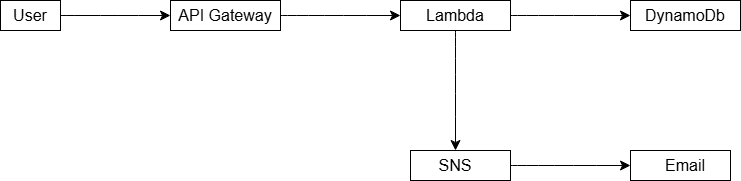

# 🚀 AWS Serverless Expense Tracker

## 📌 Project Overview

A serverless backend application built using AWS services that allows users to track expenses and receive alerts for high spending.

---

## 🧱 Architecture



---

## ⚙️ Tech Stack

* AWS Lambda (Python)
* API Gateway
* DynamoDB
* SNS (Email Alerts)
* AWS SAM (Infrastructure as Code)
* IAM (Security)

---

## 🔥 Features

* Create expense API
* Retrieve all expenses
* Delete expense
* Real-time email alerts for high expenses (> ₹5000)
* Fully serverless architecture

---

## 🚀 Deployment

Deployed using AWS SAM CLI:

```bash
sam build
sam deploy
```

---

## 🧪 API Endpoints

### Create Expense

POST /expense

```json
{
  "amount": 500,
  "category": "food"
}
```

---

### Get Expenses

GET /expenses

---

### Delete Expense

DELETE /expense/{id}

---

## 📧 Event-Driven Feature

SNS is used to send email alerts when expense exceeds threshold, demonstrating event-driven architecture.

---

## 💡 Learnings

* Implemented serverless architecture using AWS
* Debugged Lambda runtime errors
* Managed IAM roles and permissions
* Built event-driven workflows using SNS

---

## 💰 Cost Optimization

* Used AWS Free Tier services
* Pay-per-request DynamoDB
* Serverless compute (no idle cost)

---

## 📌 Future Improvements

* Add user authentication (Cognito)
* Add frontend (React)
* Add analytics dashboard

---
